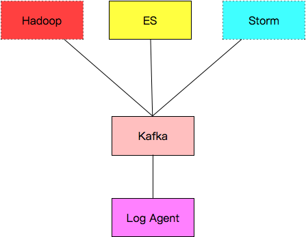
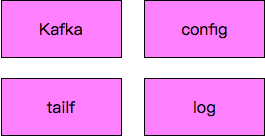
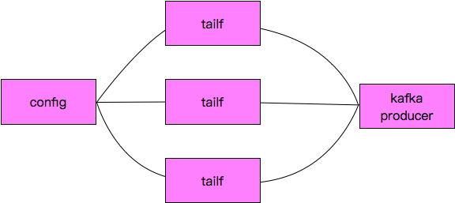

logagent
===============

logagent是一个golang编写的高并发，高容错的分布式日志收集系统，关键技术有

- etcd [TODO]
- kafka [FINISHED]
- ES
- golang底层的日志库 [FINISHED]

需求
--------

1 将机器上的日志实时收集，统一存储到中心系统
2 对收集到的日志建立索引，通过ES开源的搜索框架对日志进行检索
3 通过提供友好的web界面，在前端就可以实现日志搜索

架构
----------

- Log Agent，日志收集客户端，用来收集服务器上的日志
- Kafka，高吞吐量的分布式队列，linkin开发，apache顶级开源项目
- ES，elasticsearch，开源的搜索引擎，提供基于http restful的web接口
- Hadoop，分布式计算框架，能够对大量数据进行分布式处理的平台

tail实例代码
------------
**TODO**

kafka实例代码
------------
**TODO**

etcd实例代码
---------
**TODO**

